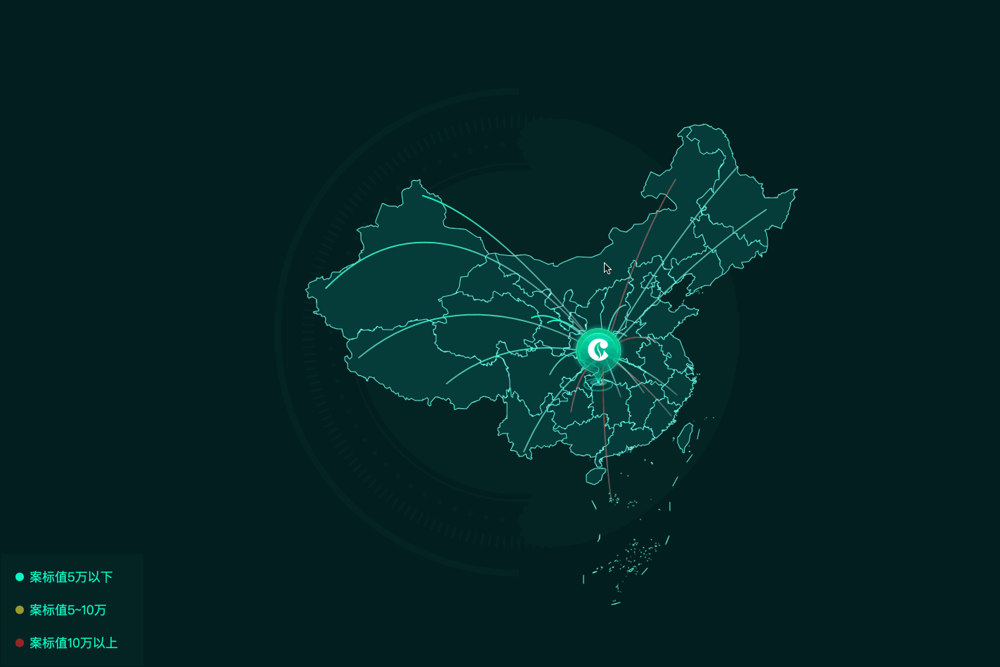

哈喽啊小伙伴们，我又来写干货咯。

最近公司有个新项目，需求如下

- 内网无法连接互联网
- 需要支持交互，诸如zoom之后要显示不同的东西
- 要绘制点对点的弧线

不能联网，交互。肯定是使用leaflet来部署离线地图了。如何部署离线地图，如何下载离线瓦片地图可以查看我本专栏内的另一篇。

对于前两个要求来说，早已经熟能生巧了。但是绘制点对点的弧线这个就犯了难，且需要线渐变显示。

	

最终效果如上

点击闪动的小点效果如下。


如上图的显示，我们可以看到有以下元素

- 图像点
- 线（弧线）
- 渐变

### 画渐变线

需要使用[@elfalem/leaflet-curve](https://github.com/elfalem/Leaflet.curve)插件来用于绘制贝塞尔曲线和其他复杂形状的 Leaflet 插件。来直接看下代码

```typescript
    drawLine(
        params: any,
        option?: {
            className?: string;
            gradientColors: string[];
        },
    ) {
        const { gradientColors } = option || {
            gradientColors: ['rgba(255, 255, 255, 1)', 'rgba(0, 0, 0, 1)'],
        };
        const start = params[0];
        const end = params[1];

        const center = this.caculateRoundTop([start, end]); // 计算曲线中心点

        // 使用渐变色创建曲线
        const curve = L.curve(['M', start, 'C', start, center, end], {
            color: 'url(#gradient)',
            fill: false,
            weight: 2,
        });

        // 创建渐变色 SVG
        const gradientId = `gradient-${Math.random().toString(36).substr(2, 9)}`;
        const gradient = `<svg xmlns="http://www.w3.org/2000/svg">
                            <defs>
                                <linearGradient id="${gradientId}" x1="0" y1="0" x2="1" y2="1">
                                    <stop offset="0%" stop-color="${gradientColors[0]}" />
                                    <stop offset="100%" stop-color="${gradientColors[1]}" />
                                </linearGradient>
                            </defs>
                          </svg>`;

        // 添加渐变色到地图
        const svgIcon = L.divIcon({
            className: 'leaflet-data-marker',
            html: gradient,
        });

        // 创建临时标记以添加 SVG 到地图
        const tempMarker = L.marker(center, { icon: svgIcon });
        tempMarker.addTo(this.map);

        // 更新曲线的颜色引用到渐变色 ID
        curve.setStyle({ color: `url(#${gradientId})` });
        curve.addTo(this.map);
    }
```

<center style="font-weight:bold;">code-001</center>

画一个贝塞尔曲线在leaflet中需要有三个点，但是我们在实际开发中。中间点也就是弧线的最高点需要我们自己计算。这里我们假设两点之间的最高点距离位于两点中位的垂直点的距离为100km。那么我们需要计算最高点的经纬度。如下

````typescript
caculateRoundTop(points: any): any {
        /**
         * 计算点对象弧线的最高点
         */
        const pointA = { lat: points[0][1], lon: points[0][0] }; // 例如，纽约的经纬度
        const pointB = { lat: points[1][1], lon: points[1][0] }; // 例如，洛杉矶的经纬度

        // 地球半径（单位：千米）
        const earthRadius = 6371;

        // 计算 AB 线段的中点坐标
        const midPoint = {
            lat: (pointA.lat + pointB.lat) / 2,
            lon: (pointA.lon + pointB.lon) / 2,
        };

        // 假设希望第三点在 AB 线段上方的距离为 distance（单位：千米）
        const distance = -100; // 假设一个距离

        // 计算第三点 C 的经纬度坐标
        const newLat = midPoint.lat + (distance / earthRadius) * (180 / Math.PI);
        const newLon =
            midPoint.lon +
            ((distance / earthRadius) * (180 / Math.PI)) / Math.cos((midPoint.lat * Math.PI) / 180);

        return [newLon, newLat];
    }
````

<center style="font-weight:bold;">code-002</center>

大多数情况后端会给到两个点，前端用于定位点。我们可以利用图【code-002】方法来计算第三个点的经纬度。


在图【code-001】中详细写了如果绘制线。其中第17-21行是利用curve绘制线的关键代码。其中的`M`和`C`文档这么解释。


M代表移动到某个点，C代表三次贝塞尔曲线到 [lat,lng]，控制点位于前一条曲线 [lat1,lng1] 和 [lat2,lng2] 的第二个控制点的反射处

| Command | Parameters                           | Description                                                  |
| ------- | ------------------------------------ | ------------------------------------------------------------ |
| M       | [lat,lng]+                           | move to [lat,lng]                                            |
| L       | [lat,lng]+                           | line to [lat,lng]                                            |
| H       | [lng]+                               | horizontal line to [lng]                                     |
| V       | [lat]+                               | vertical line to [lat]                                       |
| C       | ([lat1,lng1],[lat2,lng2],[lat,lng])+ | cubic Bézier curve to [lat,lng] with control points at [lat1,lng1] and [lat2,lng2] |
| S       | ([lat2,lng2],[lat,lng])+             | cubic bézier curve to [lat,lng] with control points at reflection of second control point of previous curve [lat1,lng1] and [lat2,lng2] |
| Q       | ([lat1,lng1],[lat,lng])+             | quadratic Bézier curve to [lat,lng] with control point at [lat1,lng1] |
| T       | ([lat,lng])+                         | quadratic Bézier curve to [lat,lng] with control point at reflection of control point of previous curve [lat1,lng1] |
| Z       |                                      | close path (line to M)                                       |


接下来处理渐变颜色。因为leaflet默认渲染是svg所以我们可以使用svg的linearGradient来给线增加颜色。这里需要有一点点svg的基础知识。借用如上的【code-001】中的代码。

```typescript
 // 创建渐变色 SVG
        const gradientId = `gradient-${Math.random().toString(36).substr(2, 9)}`;
        const gradient = `<svg xmlns="http://www.w3.org/2000/svg">
                            <defs>
                                <linearGradient id="${gradientId}" x1="0" y1="0" x2="1" y2="1">
                                    <stop offset="0%" stop-color="${gradientColors[0]}" />
                                    <stop offset="100%" stop-color="${gradientColors[1]}" />
                                </linearGradient>
                            </defs>
                          </svg>`;
// 添加渐变色到地图
        const svgIcon = L.divIcon({
            className: 'leaflet-data-marker',
            html: gradient,
        });

        // 创建临时标记以添加 SVG 到地图
        const tempMarker = L.marker(center, { icon: svgIcon });
        tempMarker.addTo(this.map);

        // 更新曲线的颜色引用到渐变色 ID
        curve.setStyle({ color: `url(#${gradientId})` });
        curve.addTo(this.map);

```

<center style="font-weight:bold;">code-003</center>

由于我这里的渐变只有两个段，故我这里只有两个颜色。如果你的需要需要有多个渐变段那么你可以传入多个颜色片段。

【code-003】中需要注意的是，我们在给curve线添加渐变的时候，每次的创建svg的linearGradient需要给到一个唯一的id。这点非常重要，要不然同一个页面有多个linearGradient的id的话会不渲染。

### 添加icon或者点到地图上

这里只给到天价图片marker的代码实例。如下

```typescript

    drawMarker(point: LatLngTuple, option?: L.DivIconOptions, data?: any) {
        const myIcon = L.divIcon({ ...{ html: `<image src=${option?.iconUrl} />` }, ...option });
        const marker: _Marker = L.marker(point, { icon: myIcon });
        marker.data = data;
        marker.addEventListener('click', (e) => {
            this.markerClick && this.markerClick(e.target.data);
        });
        marker.addTo(this.map);
    }
```

不用过多解释，可以去参考下leaflet的[文档](https://leafletjs.cn/reference.html)。

