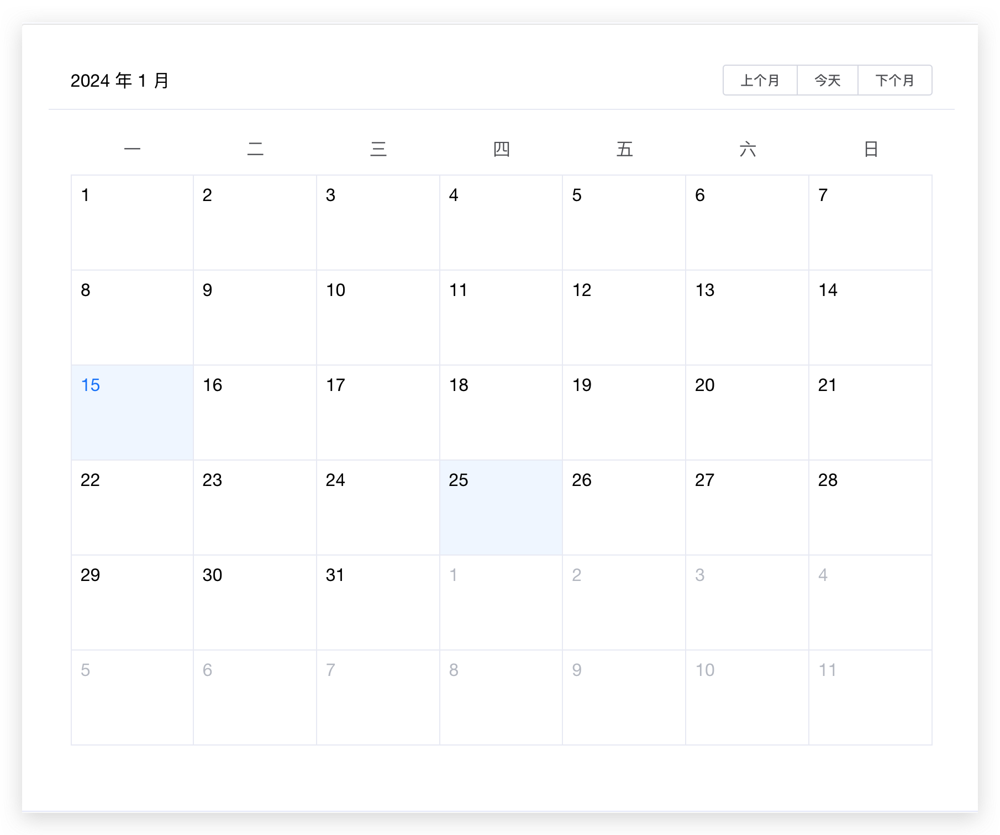
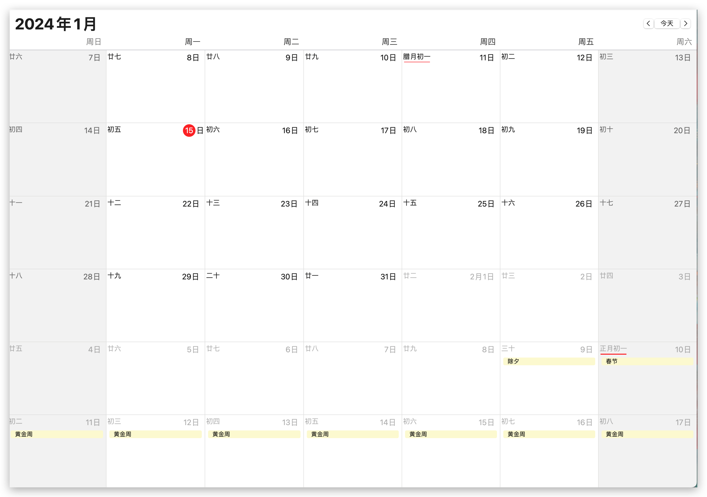
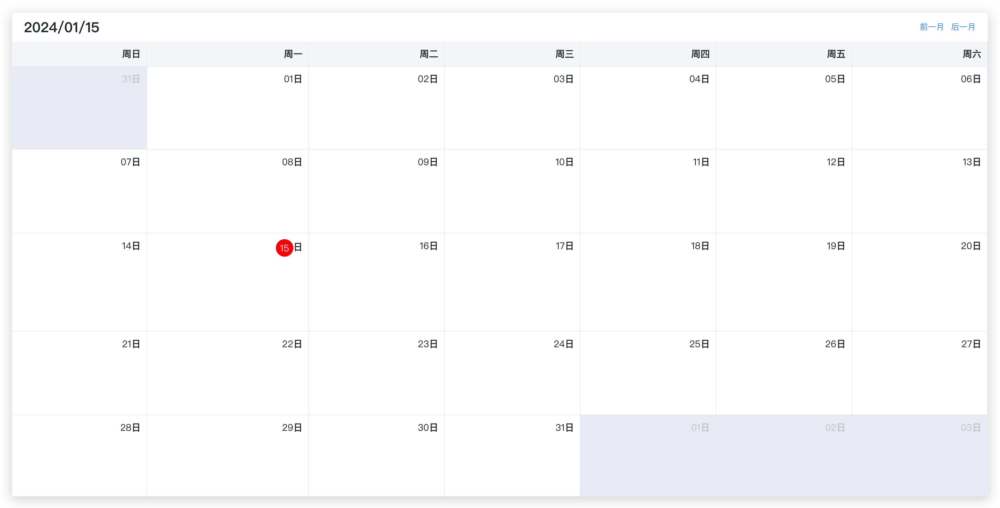

## 需求分析

突然接到一个排班的需求。

看了下算是比较老的项目，使用的是vue2+element开发的，使用的是element的UI组件库。去查看下element的`Calendar`组件。⬇️长这样



看起来没什么大问题。星期几信息和每天的信息都很详细。但是和我的需求不符合，排班需要在一个日期范围内显示一些内容。显然element的calendar文档只能选中单个日期，无法完全满足我的需求。


手滑不小心点到了电脑的日历📅组件⬇️

于是就想着按照Apple 的日历应用ui来做。

## 代码逻辑分析

- 使用table还是flex布局来渲染？
- 当当前月份的第一天不是周日怎么办？
- 当当前月份的最后一天不是周六怎么办？

## 代码实现

选择table来布局。根据table的布局来定数据结构

```html
table
 thead
  th
 tbody
  tr
   td
```

## 优先渲染表头

由于项目内部已经安装了moment时间处理库，所以本文都使用[moment](http://momentjs.cn/)时间处理库来做时间处理。当然你也可以用类似的[dayjs](https://day.js.org/)来处理一样的。主要使用的是moment时间的加减方法，用到的方法如下。

- `fn.startOf` 
- `fn.endOf`
- `fn.add`
- `fn.subtract`
- `fn.format`
- `fn.day()`

## 实现代码思路

- 通过`fn.startOf`和`fn.endOf`来获取需要截取的开始结束时间区间。
- 判断上一步的开始时间是星期几，结束时间是星期几。如果开始时间不是星期天或者最后一天不是星期六则需要补全上个月的日期和下个月的日期。因为我们是以7天为一个横向区间。

## 代码实现

### 日历头的数据渲染

```javascript
const titles = {
    0: '周日',
    1: '周一',
    2: '周二',
    3: '周三',
    4: '周四',
    5: '周五',
    6: '周六',
};
let i = 0;
while (i < 7) {
    this.calendarHeader.push({
        title: titles[i],
        value: i,
    });
    i++;
}
```

### 显示区间的数据渲染

```javascript
const startDate = this.$moment(this.currentDate).startOf('month');
const endDate = this.$moment(this.currentDate).endOf('month');
let monthdays = [];
for (let i = startDate; i <= endDate; i.add(1, 'day')) {
    monthdays.push({
        date: i,
        week: this.$moment(i).day(),
        format: i.format('YYYY/MM/DD'),
        day: i.format('DD'),
        data: {}
    });
}
```

### 判断是否需要填充上个月的日期作为本月补充显示

```javascript
const startDay = monthdays[0];
if (startDay.week !== 0) {
    // 填补上月在本周的日期
    const {format, week} = startDay;
    let frontDays = [];
    for (let i= week -1; i >= 0;i--) {
        const date = this.$moment(format).subtract( i, 'day');
        const subtractDay = this.$moment(format).subtract( i + 1, 'day');
        const day = {
            date,
            week: subtractDay.day(),
            format:  subtractDay.format('YYYY/MM/DD'),
            day: subtractDay.format('DD'),
            data: {
                disabled: true
            }
        }
        frontDays.push(day);
    }
    monthdays = [...frontDays, ...monthdays]
}
```

### 判断是否需要填充下个月的日期作为本月补充显示

```javascript
const endDay = monthdays[monthdays.length - 1]
if(endDay.week !== 6) {
    const {format, week} = endDay;
    let j = 1;
    for (let i = week;i < 6;i++) {
        monthdays.push({
            date: this.$moment(format).add( j, 'day'),
            week: week + j,
            format:  this.$moment(format).add( j, 'day').format('YYYY/MM/DD'),
            day: this.$moment(format).add( j, 'day').format('DD'),
            data: {
                disabled: true
            }
        });
        j++
    }
}
```

### 以0-6为区间判断一周做数据切割

```javascript
let _week = [];
for (let i = 0; i < monthdays.length; i++) {
    const { week } = monthdays[i];
    if (week <= 6 && week !== 0) {
        _week.push(monthdays[i]);
        if (i === monthdays.length - 1) {
            // 如果这个月的最后几天没有星期天就把剩下的天数单独分为一周
            this.calendar.push(_week);
            _week = [];
        }
    } else if (week == 0) {
        this.calendar.push(_week);
        // 如果是周日则换一行
        _week = [];
        _week.push(monthdays[i]);
    }
}
```


## 至此完成之后页面长这样




